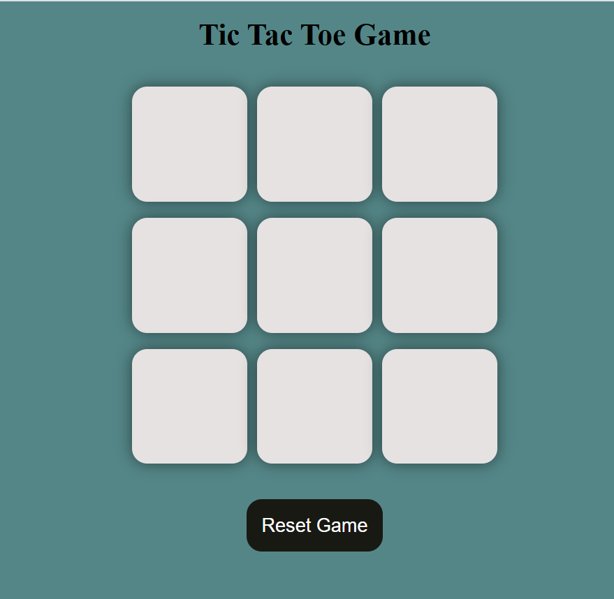
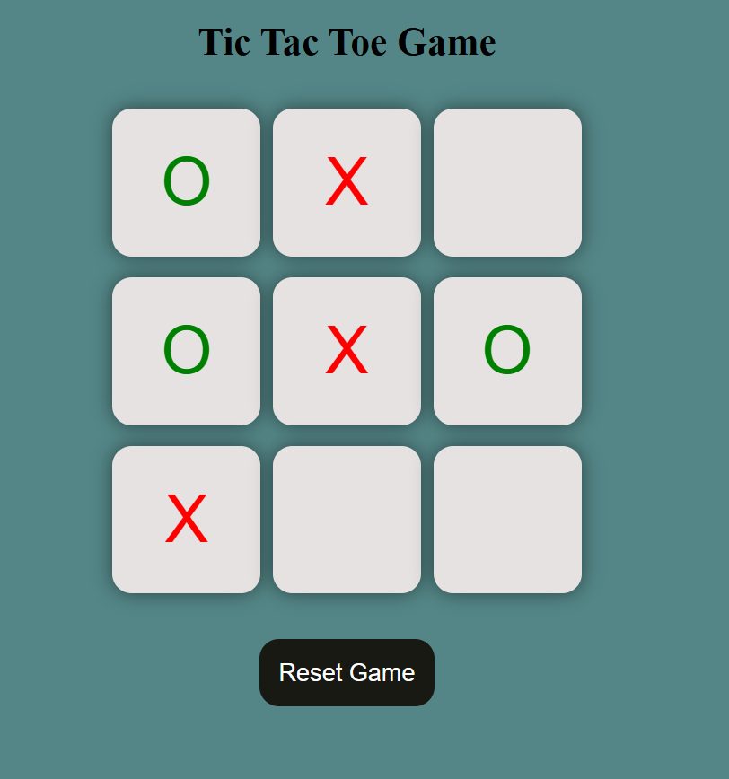
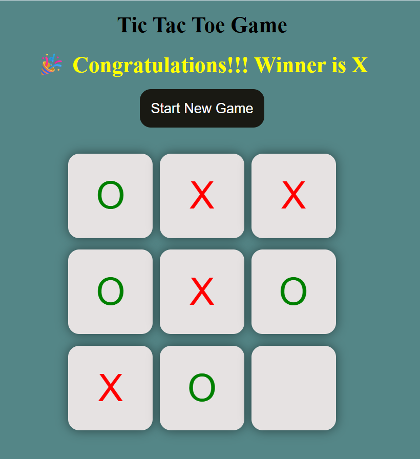
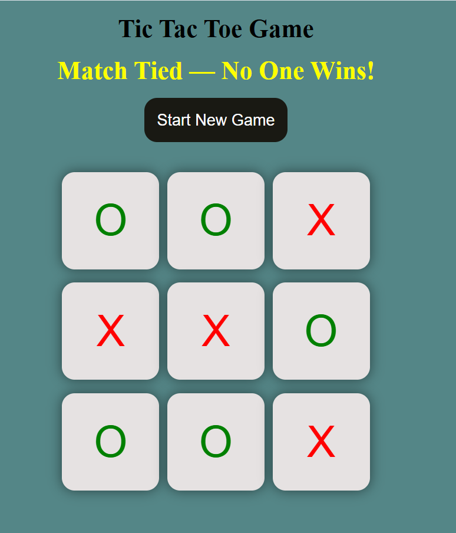

# 🎮 Tic Tac Toe Game (HTML + CSS + JavaScript)

A simple and interactive **Tic Tac Toe Game** built using **pure HTML, CSS, and JavaScript**.  
This project helped me practice DOM manipulation, event handling, and basic game logic in JavaScript.

---

## 🚀 Live Demo  
### ▶️ Game Board  




### 🏆 Winner Popup  


### 🏆 Match Tied  

---

## ⭐ Features

### ✅ Core Game Features
- Two-player game (**X vs O**)
- Detects winner automatically
- Detects draw (tie) when board is full
- Highlights winner message
- Reset Game & New Game options

### ✅ UI Features
- Clean layout using **CSS Flexbox**
- Button-based board (9 interactive cells)
- Disabled buttons after click to prevent overwriting
- Message popup for winner or tie

### ✅ JavaScript Logic
- Win pattern checking using fixed combinations
- Box disabling logic
- Reset functionality
- Turn switching between **X** and **O**
- No external libraries used — **100% pure JS**

1. Clone the repository:
   ```bash
   https://github.com/AkashWarkhad/Tic-Tac-Toe-Game.git

2. Open the project folder:
   ```bash
   cd tic-tac-toe-game
3. Run the game by opening:
   ```bash
   index.html
---
   

